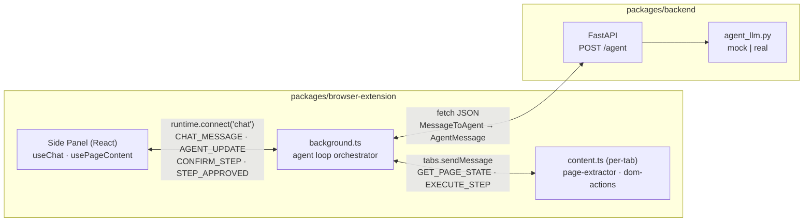

# Repo Structure

A tour of what lives where in this repo. For setup, see [`README.md`](./README.md); for architecture and data-flow, see [`AI-Browser.md`](./AI-Browser.md).

This is a pnpm monorepo with two packages:

- [`packages/browser-extension`](#packagesbrowser-extension) — Chrome extension (WXT + React + TypeScript)
- [`packages/backend`](#packagesbackend) — FastAPI agent backend (Python ≥3.11)

## At a glance

```
AI-Browser/
├── package.json              ← pnpm workspace root, ext:* / backend:* scripts
├── pnpm-workspace.yaml
├── README.md                 ← setup & quick start
├── AI-Browser.md             ← architecture & data-flow
├── STRUCTURE.md              ← (this file)
│
└── packages/
    ├── browser-extension/    ← WXT + React + TS Chrome MV3 extension
    │   ├── wxt.config.ts
    │   ├── tsconfig.json
    │   ├── vitest.config.ts
    │   ├── entrypoints/
    │   │   ├── background.ts         ← service-worker agent loop orchestrator
    │   │   ├── content.ts            ← per-tab DOM bridge (idMap owner)
    │   │   └── sidepanel/            ← React chat UI
    │   │       ├── main.tsx · App.tsx · index.html · style.css
    │   │       ├── components/       ← ChatPanel, MessageBubble,
    │   │       │                       ActionConfirmDialog, PageContextBadge
    │   │       └── hooks/            ← useChat, usePageContent
    │   ├── lib/
    │   │   ├── messaging.ts          ← typed protocol + all shared models
    │   │   ├── api-client.ts         ← callAgent() POST client
    │   │   ├── page-extractor.ts     ← extractPageState() → PageState + idMap
    │   │   ├── dom-actions.ts        ← executeStep() dispatcher
    │   │   ├── security.ts           ← validateStep() + rate limiter
    │   │   └── __tests__/            ← Vitest (one per lib module)
    │   └── public/icons/
    │
    └── backend/              ← FastAPI agent backend (Python ≥3.11)
        ├── pyproject.toml
        ├── app/
        │   ├── main.py               ← create_app(), /healthz, POST /agent
        │   ├── schemas.py            ← Pydantic: MessageToAgent, PageState,
        │   │                           BrowserElementData, Step, AgentMessage, …
        │   └── agent_llm.py          ← run_agent() — mock + real LLM hook
        └── tests/test_chat.py
```

---

## Repo root

| Path | Purpose |
|------|---------|
| `package.json` | Workspace manifest; top-level `ext:*` and `backend:*` scripts. |
| `pnpm-workspace.yaml` | Declares `packages/*` as the workspace root. |
| `README.md` | Quick start: install, dev servers, backend venv setup. |
| `AI-Browser.md` | Architecture plan, tech-stack rationale, data-flow diagram, security policies. |
| `STRUCTURE.md` | This file — navigational map of the repo. |
| `.nvmrc` | Pins Node 20. |
| `.gitignore` | Ignores `node_modules`, build outputs, Python venvs, `.env`. |

---

## `packages/browser-extension/`

Chrome MV3 extension. WXT generates the manifest from `wxt.config.ts` and each file under `entrypoints/` becomes a context (background worker, content script, side panel).

### Config

| Path | Purpose |
|------|---------|
| `wxt.config.ts` | Manifest: permissions (`sidePanel`, `tabs`, `activeTab`, `scripting`, `storage`), host permissions, side-panel default path. |
| `tsconfig.json` | Strict TS, React JSX, `@/*` path alias. |
| `vitest.config.ts` | happy-dom env, tests under `lib/__tests__/`. |
| `package.json` | `dev`, `build`, `compile`, `test` scripts. |

### `entrypoints/`

| Path | Purpose |
|------|---------|
| `background.ts` | Orchestrator service worker. Runs the agent loop: fetches `PageState` from the active tab, calls `POST /agent`, executes each `Step` in the returned batch through the validate → rate-limit → user-confirm → dispatch pipeline, then sends a `FeedbackMessage` back for multi-turn continuation. Caps at 10 turns. |
| `content.ts` | Per-tab content script (matches `<all_urls>`, `document_idle`). Handles `GET_PAGE_STATE` (runs the extractor, stores the `idMap`) and `EXECUTE_STEP` (looks up the element by numeric id in the idMap, runs the action). |
| `sidepanel/index.html` | HTML shell for the side panel. |
| `sidepanel/main.tsx` | Mounts `<App/>` to `#root`. |
| `sidepanel/App.tsx` | Renders `<ChatPanel/>`. |
| `sidepanel/style.css` | Tailwind directives + custom styles. |

#### `entrypoints/sidepanel/components/`

| Path | Purpose |
|------|---------|
| `ChatPanel.tsx` | Top-level UI: message feed, input form, page-context badge, step-confirm dialog. |
| `MessageBubble.tsx` | Renders a single message bubble (user or assistant). |
| `ActionConfirmDialog.tsx` | Allow/Deny prompt shown when the LLM proposes a Step — displays action kind, target element name, and explanation. |
| `PageContextBadge.tsx` | Shows page title / URL / element count with a Refresh button and include-page toggle. |

#### `entrypoints/sidepanel/hooks/`

| Path | Purpose |
|------|---------|
| `useChat.ts` | Owns the chat port, message list, pending state, and `pendingStep`. Exposes `send()` and `decideStep()`. Renders turn explanations, step plans, and per-step results from `AGENT_UPDATE` messages. |
| `usePageContent.ts` | Requests a fresh `PageState` from the active tab; exposes `state`, `loading`, `refresh()`. |

### `lib/`

| Path | Purpose |
|------|---------|
| `messaging.ts` | Typed discriminated-union message protocol; all shared models (`PageState`, `BrowserElementData`, `ElementBounds`, `ElementState`, `InteractiveElementsMap`, `Tab`, `Step`, `AgentMessage`, `StepFeedback`, `FeedbackMessage`, `MessageToAgent`); helpers (`makeMessage`, `isMessageOfKind`, `sendRuntime`, `sendToTab`). |
| `api-client.ts` | `callAgent()` — POSTs a `MessageToAgent` to `POST /agent` and returns the `AgentMessage` JSON response. Retries once on 5xx. |
| `page-extractor.ts` | `extractPageState()` — walks the DOM, resolves ARIA roles, captures bounds/state, assigns numeric ids, groups into `InteractiveElementsMap`, builds `interactiveElementsString`. Returns `{ pageState, idMap }`. |
| `dom-actions.ts` | `executeStep(step, idMap)` dispatcher for `click` / `hover` / `type` / `scroll` / `navigate` / `waitForPageReady` / `goBack` / `goForward` / `refresh`. `switchTab` is rejected (handled by background). |
| `security.ts` | `validateStep()` (URL scheme allowlist for `navigate`) and `createRateLimiter()`. |
| `__tests__/` | Vitest suites — one file per `lib/` module. |

### `public/`

| Path | Purpose |
|------|---------|
| `icons/` | Extension icon assets bundled into the build. |

---

## `packages/backend/`

FastAPI server exposing `POST /agent`. Accepts `MessageToAgent`, returns `AgentMessage` (plain JSON). LLM backend is selected via the `AIB_LLM_BACKEND` env var.

### Config

| Path | Purpose |
|------|---------|
| `pyproject.toml` | Dependencies (`fastapi`, `uvicorn`, `sse-starlette`, `pydantic`), dev deps (`pytest`, `httpx`, `anyio`), pytest config. |

### `app/`

| Path | Purpose |
|------|---------|
| `main.py` | `create_app()` factory; CORS (restricted to `chrome-extension://*`, override via `AIB_ALLOW_ORIGINS`); `GET /healthz`; `POST /agent`. |
| `schemas.py` | Pydantic models mirroring the TS types: `MessageToAgent`, `PageState`, `BrowserElementData`, `ElementBounds`, `ElementState`, `Tab`, `Step`, `AgentMessage`, `StepFeedback`, `FeedbackMessage`. |
| `agent_llm.py` | `run_agent(MessageToAgent) → AgentMessage`. `mock` mode: deterministic keyword-match → click step. `real` mode: stub — implement `_real_agent()` to call your custom LLM; the system prompt should request `AgentMessage` JSON and pass `pageState.interactiveElementsString` verbatim. |

### `tests/`

| Path | Purpose |
|------|---------|
| `test_chat.py` | Covers `/healthz`, agent without page (returns completed), agent with a button page (returns click step), and successful-feedback completion. |

---

## How the pieces talk



- **Side panel ↔ background** — long-lived `chrome.runtime.connect({ name: "chat" })` port for chat traffic; `AGENT_UPDATE` carries turn explanations, step plans, and step results; `CONFIRM_STEP`/`STEP_APPROVED` gate each action.
- **Background ↔ content script** — `chrome.tabs.sendMessage` request/response: `GET_PAGE_STATE` (snapshot + idMap), `EXECUTE_STEP` (lookup by numeric id + dispatch).
- **Background → backend** — `fetch` POST `http://localhost:8000/agent`, plain JSON request/response.

---

## Where to look for…

| Task | Start here |
|------|------------|
| Change the chat UI | `packages/browser-extension/entrypoints/sidepanel/components/ChatPanel.tsx` |
| Add a new action kind | `lib/messaging.ts` (`StepAction`) → `lib/dom-actions.ts` (`executeStep`) → `lib/security.ts` (`validateStep`) → `packages/backend/app/schemas.py` (`StepAction`) |
| Change what the extractor captures | `packages/browser-extension/lib/page-extractor.ts` |
| Wire the real LLM | `packages/backend/app/agent_llm.py` (`_real_agent`) |
| Adjust CORS or the backend URL | `packages/backend/app/main.py` (CORS) + `packages/browser-extension/entrypoints/background.ts` (`BACKEND_URL`) |
| Add a manifest permission | `packages/browser-extension/wxt.config.ts` |
| Add a new side-panel hook/component | `entrypoints/sidepanel/hooks/` or `entrypoints/sidepanel/components/` |
| Understand the element format sent to the LLM | `packages/browser-extension/lib/page-extractor.ts` → `renderElementsString()` |
