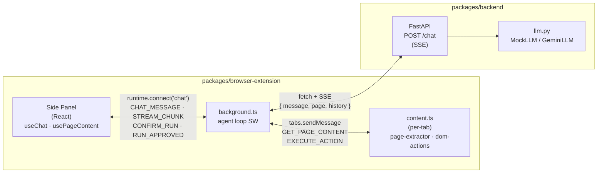

# Repo Structure

A tour of what lives where in this repo. For setup, see [`README.md`](./README.md); for architecture and data-flow, see [`AI-Browser.md`](./AI-Browser.md).

This is a pnpm monorepo with two packages:

- [`packages/browser-extension`](#packagesbrowser-extension) — Chrome extension (WXT + React + TypeScript)
- [`packages/backend`](#packagesbackend) — FastAPI server with pluggable LLM backend (Python ≥3.11)

## At a glance

```
AI-Browser/
├── package.json              ← pnpm workspace root, ext:* / backend:* scripts
├── pnpm-workspace.yaml
├── README.md                 ← setup & quick start
├── AI-Browser.md             ← architecture & data-flow
├── STRUCTURE.md              ← (this file)
│
└── packages/
    ├── browser-extension/    ← WXT + React + TS Chrome MV3 extension
    │   ├── wxt.config.ts
    │   ├── tsconfig.json
    │   ├── vitest.config.ts
    │   ├── entrypoints/
    │   │   ├── background.ts         ← service-worker orchestrator + agent loop
    │   │   ├── content.ts            ← per-tab DOM bridge
    │   │   └── sidepanel/            ← React chat UI
    │   │       ├── main.tsx · App.tsx · index.html · style.css
    │   │       ├── components/       ← ChatPanel, MessageBubble,
    │   │       │                       ActionConfirmDialog (RunConfirmDialog),
    │   │       │                       PageContextBadge
    │   │       └── hooks/            ← useChat, usePageContent
    │   ├── lib/
    │   │   ├── messaging.ts          ← typed message protocol + shared models
    │   │   ├── api-client.ts         ← streamChat() SSE client
    │   │   ├── page-extractor.ts     ← extractPageContent()
    │   │   ├── dom-actions.ts        ← executeAction() dispatcher
    │   │   ├── security.ts           ← validateAction() + rate limiter
    │   │   └── __tests__/            ← Vitest (one per lib module)
    │   └── public/icons/
    │
    └── backend/              ← FastAPI server with pluggable LLM (Python ≥3.11)
        ├── pyproject.toml
        ├── app/
        │   ├── main.py               ← create_app(), /healthz, POST /chat (SSE)
        │   ├── llm.py                ← LLM interface, MockLLM, GeminiLLM stub, get_llm()
        │   ├── mock_llm.py           ← turn-aware mock_stream() async generator
        │   └── schemas.py            ← Pydantic: ChatRequest, PageContent, TurnRecord, Action
        └── tests/test_chat.py
```

---

## Repo root

| Path | Purpose |
|------|---------|
| `package.json` | Workspace manifest; top-level `ext:*` and `backend:*` scripts. |
| `pnpm-workspace.yaml` | Declares `packages/*` as the workspace root. |
| `README.md` | Quick start: install, dev servers, backend venv setup. |
| `AI-Browser.md` | Architecture plan, tech-stack rationale, data-flow diagram, security policies. |
| `STRUCTURE.md` | This file — navigational map of the repo. |
| `.nvmrc` | Pins Node 20. |
| `.gitignore` | Ignores `node_modules`, build outputs, Python venvs, `.env`. |

---

## `packages/browser-extension/`

Chrome MV3 extension. WXT generates the manifest from `wxt.config.ts` and each file under `entrypoints/` becomes a context (background worker, content script, side panel).

### Config

| Path | Purpose |
|------|---------|
| `wxt.config.ts` | Manifest: permissions (`sidePanel`, `tabs`, `activeTab`, `scripting`, `storage`), host permissions, side-panel default path. |
| `tsconfig.json` | Strict TS, React JSX, `@/*` path alias. |
| `vitest.config.ts` | happy-dom env, tests under `lib/__tests__/`. |
| `package.json` | `dev`, `build`, `compile`, `test` scripts. |

### `entrypoints/`

| Path | Purpose |
|------|---------|
| `background.ts` | Orchestrator service worker. Asks for one-time run approval, then loops up to 10 turns: fetches page content, POSTs to backend with accumulated `history`, parses SSE chunks, validates + rate-limits actions, dispatches to content script, accumulates `TurnRecord`. Exits when backend signals `completed: true` or a turn produces no actions. |
| `content.ts` | Per-tab content script (matches `<all_urls>`, `document_idle`). Handles `GET_PAGE_CONTENT` (runs the extractor) and `EXECUTE_ACTION` (runs the action dispatcher). |
| `sidepanel/index.html` | HTML shell for the side panel. |
| `sidepanel/main.tsx` | Mounts `<App/>` to `#root`. |
| `sidepanel/App.tsx` | Renders `<ChatPanel/>`. |
| `sidepanel/style.css` | Tailwind directives + custom styles. |

#### `entrypoints/sidepanel/components/`

| Path | Purpose |
|------|---------|
| `ChatPanel.tsx` | Top-level UI: message feed, input form, page-context badge, run-confirm dialog. |
| `MessageBubble.tsx` | Renders a single message; streams tokens as they arrive. |
| `ActionConfirmDialog.tsx` | Exports `RunConfirmDialog` — one-time Run/Cancel prompt shown at the start of each agent run. |
| `PageContextBadge.tsx` | Shows page title / URL / element count with a Refresh button and include-page toggle. |

#### `entrypoints/sidepanel/hooks/`

| Path | Purpose |
|------|---------|
| `useChat.ts` | Owns the chat port, message list, pending state, and `pendingRun`. Exposes `send()` and `approveRun()`. |
| `usePageContent.ts` | Requests a fresh `PageContent` from the active tab; exposes `content`, `loading`, `refresh()`. |

### `lib/`

| Path | Purpose |
|------|---------|
| `messaging.ts` | Typed discriminated-union message protocol; shared models (`PageContent`, `InteractiveElement`, `LLMAction`, `TurnRecord`, `StreamChunk`); helpers (`makeMessage`, `isMessageOfKind`, `sendRuntime`, `sendToTab`). |
| `api-client.ts` | `streamChat()` async generator — POSTs a `ChatRequest` (`message`, `page`, `history`) and yields parsed SSE `StreamChunk`s. |
| `page-extractor.ts` | DOM snapshot: `extractPageContent()` (URL, title, text, selection, interactive elements) and `buildUniqueSelector()`. |
| `dom-actions.ts` | `executeAction()` dispatcher for `click` / `fill` / `select` / `scroll` / `navigate`. |
| `security.ts` | `validateAction()` (URL scheme allowlist, selector deny-list) and `createRateLimiter()`. |
| `__tests__/` | Vitest suites — one file per `lib/` module. |

### `public/`

| Path | Purpose |
|------|---------|
| `icons/` | Extension icon assets bundled into the build. |

---

## `packages/backend/`

FastAPI server exposing a streaming `/chat` endpoint. LLM logic is behind a pluggable interface — mock by default, Gemini (or any other model) by setting `AIB_LLM_BACKEND`.

### Config

| Path | Purpose |
|------|---------|
| `pyproject.toml` | Dependencies (`fastapi`, `uvicorn`, `sse-starlette`, `pydantic`), dev deps (`pytest`, `httpx`, `anyio`), pytest config. |

### `app/`

| Path | Purpose |
|------|---------|
| `main.py` | `create_app()` factory; logging config; CORS (restricted to `chrome-extension://*`); `GET /healthz`; `POST /chat` → calls `get_llm().stream()` and returns `EventSourceResponse`. |
| `llm.py` | `LLMBackend` protocol; `MockLLM` (wraps `mock_stream`, logs each turn); `GeminiLLM` stub (`NotImplementedError`); `get_llm()` factory keyed on `AIB_LLM_BACKEND`. Emits structured JSON `llm_request`/`llm_response` log lines per turn. |
| `mock_llm.py` | `mock_stream(message, page, turn)` async generator. Turn-aware: turn 0 fills email/username field, turn 1 fills password field, turn 2 clicks submit button. Each non-final turn emits `completed: false`; the last emits `completed: true`. |
| `schemas.py` | Pydantic models: `ChatRequest` (with `history: List[TurnRecord]`), `PageContent`, `InteractiveElement`, `TurnRecord`, and the `Action` union (`ClickAction`, `FillAction`, `ScrollAction`, `NavigateAction`, `SelectAction`). |

### `tests/`

| Path | Purpose |
|------|---------|
| `test_chat.py` | Covers `/healthz`, SSE text + done termination, turn-0 fill-email, the full 3-turn login sequence (email → password → submit with `completed: true`), and early-exit when no login form is present. |

---

## How the pieces talk



- **Side panel ↔ background** — long-lived `chrome.runtime.connect({ name: "chat" })` port for chat traffic; plain `chrome.runtime.sendMessage` for one-shot requests like `GET_PAGE_CONTENT`.
- **Background ↔ content script** — `chrome.tabs.sendMessage` request/response (`GET_PAGE_CONTENT`, `EXECUTE_ACTION`).
- **Background → backend** — `fetch` POST `http://localhost:8000/chat` with `{ message, page, history }`, response parsed as SSE. Repeated each turn with growing history until `completed: true`.

Full sequence (chat message → page capture → backend → action approval → DOM mutation → loop) is diagrammed in [`AI-Browser.md`](./AI-Browser.md).

---

## Where to look for…

| Task | Start here |
|------|------------|
| Change the chat UI | `packages/browser-extension/entrypoints/sidepanel/components/ChatPanel.tsx` |
| Add a new action kind | `lib/messaging.ts` (type) → `lib/dom-actions.ts` (impl) → `lib/security.ts` (validation) → `packages/backend/app/schemas.py` (Action union) |
| Change what the extractor captures | `packages/browser-extension/lib/page-extractor.ts` |
| Plug in a real LLM | `packages/backend/app/llm.py` — implement `GeminiLLM.stream()`, set `AIB_LLM_BACKEND=gemini` |
| Adjust CORS or the backend URL | `packages/backend/app/main.py` (CORS) + `packages/browser-extension/entrypoints/background.ts` (`BACKEND_URL`) |
| Add a manifest permission | `packages/browser-extension/wxt.config.ts` |
| Add a new side-panel hook/component | `entrypoints/sidepanel/hooks/` or `entrypoints/sidepanel/components/` |
| Change the agent turn limit | `packages/browser-extension/entrypoints/background.ts` (`MAX_TURNS`) |
